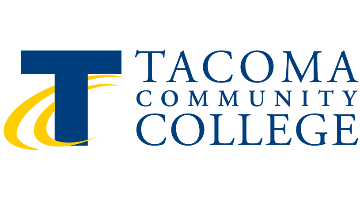

# CS 142 — Fall 2026 Example Code Repository

This repository contains the example code written during class each week.
To view the source code for a given week, click on the folder for that week (e.g. `Week1`).
Code is added throughout the quarter as we cover each topic in class.

---

**Class Time:**

Optional if you need help setting up eclipse: Friday 9/25 12:30-2:30 pm 16-109

Exam 1: Friday 10/9 12:30 - 2:30 pm 16-109

Exam 2: Friday 10/30 12:30 - 2:30 pm 16-109

Exam 3: Friday 11/20 12:30 - 2:30 pm 16-109

Final exam to be scheduled
**Class Location:** Building 16 Room 109

## Resources for Help

### 1. Office Hours

I will be conducting office hours Monday mornings via Zoom @ 9AM 

<a href="https://rtcedu.zoom.us/my/joshuaemery?pwd=Tnl1dXo2K0FVek5LUmY0bEk3Z2k5dz09">Office Hours Link</a>

### 2. Tutoring

Science, Engineering & Math Tutoring Center (SEMTC)

In-person drop-in and appointment tutoring for SEM courses.

Hours: Monday – Thursday from 10:00am-5:00pm (CLOSED Friday – Sunday)

Location: Building 19 Room 22

To make an appointment: Call 253-566-5145, email SEMtutoring@tacomacc.edu, or stop by our center

### 3. Contact

Contact me via Canvas message. I will respond within 24 hours Mon–Thurs. I check messages over the weekend but cannot guarantee a 24-hour response.

> **Note on code questions:** Please send the actual code as an attachment or paste it into the message body. Do not send a screenshot — I cannot run a picture.
